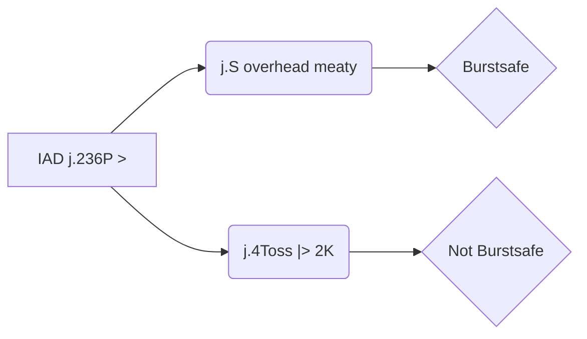

Hardli doc

https://docs.google.com/document/d/1VMM1XUubhDn6LfLzp31sOYFsFczlFQPPwhbWBrNxruM/edit

## Corner Bridal

https://www.youtube.com/watch?v=9_S3iGmw9R4

### trying on Ky

Bot settings: !5,4,6HP

questions:

c.s f.S 2D Bridal -> IAD j.pull j.toss

seems to have a bit of different meaty/oki timing than 

c.s f.S Bridal -> IAD j.pull j.toss

c.s f.S 2D Bridal -> IAD j.pull j.S    if done ASAP doesn't meaty Ky, will need to mess arround i guess?

c.s 2D Bridal -> IAD j.pull j.S    if done ASAP doesn't meaty Ky, will need to mess arround i guess?

Bot settings: 5,!4,6HP

### Trying on sol

Bot settings: !6SH

c.s f.S 2D Bridal -> IAD j.pull j.S    if done ASAP I get throw/doesn't meaty ky. If done slightly delayed, Sol gets blitz, berry hits blitz, ok.

## 5Hx5 Safejump

https://www.youtube.com/watch?v=Aw_d0im2mO4&ab_channel=hardly

## j.D YRC