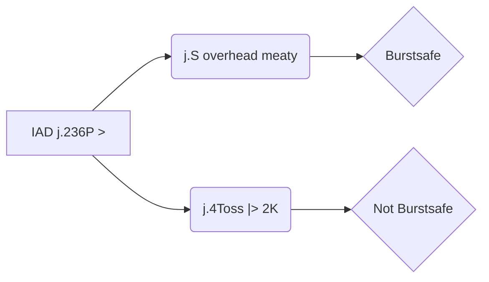

Hardli doc

https://docs.google.com/document/d/1VMM1XUubhDn6LfLzp31sOYFsFczlFQPPwhbWBrNxruM/edit

## Corner Bridal

https://www.youtube.com/watch?v=9_S3iGmw9R4

## OLD idk
### trying on Ky

Bot settings: !5,4,6HP

questions:

c.s f.S 2D Bridal -> IAD j.pull j.toss

seems to have a bit of different meaty/oki timing than 

c.s f.S Bridal -> IAD j.pull j.toss

c.s f.S 2D Bridal -> IAD j.pull j.S    if done ASAP doesn't meaty Ky, will need to mess arround i guess?

c.s 2D Bridal -> IAD j.pull j.S    if done ASAP doesn't meaty Ky, will need to mess arround i guess?

Bot settings: 5,!4,6HP

### Trying on sol

Bot settings: !6SH

c.s f.S 2D Bridal -> IAD j.pull j.S    if done ASAP I get throw/doesn't meaty ky. If done slightly delayed, Sol gets blitz, berry hits blitz, ok.

### j.S vs j.H

> Elphelt j.H KDs on air hit. Elphelt j.S combos on air hit. Like 1f airborne moves like Sol wake up riot stamp or Faust wake up pogo exist, or you miss the meaty and the opponent jumped, or you hit a late frame of a wake up backdash, for example, then j.H doesn't combo. Neither Elphelt j.S nor j.H has proration, but Elphelt j.S deals 28 damage and j.H 34 damage (on Sol), which affects combo damage.  (Text from SmashK, copy paste)

### IDK but on the same topic

- Corner Bridal ender IAD pull j.S oki ()

https://www.dustloop.com/w/GGXRD-R2/Frame_Data#Backdash_and_Wake-up_Values

As reference, iad whenever opponent touches the ground, not before.

### Pros / Cons / Mix

- High
- Safejump
- Still not sure how to hit/punish opponents backdashing other than land -> 2pppppp
- Looses to Blitz

### Punishing DPs/reversals

#### Sol S dp

Sol dp is crouch recovery

#### Route 1

walkup 2D

Do a little walkup 

https://youtu.be/J94gVjM5cy4

#### Route 2

f.S > toss > f.S

Do a little walkup 

https://youtu.be/7M9Cm5e6Mm8

#### Route 3

f.S 2H(1) Toss

https://youtu.be/vx2LcE36b_g

#### Route 4

Do a little walkup

c.S dl f.S dl 2D > Toss

(cant recommend)

https://youtu.be/uma73yWHGco

#### Crouching confirm 1

2H Toss 2D

#### Crouching confirm 2

2H 2D Toss

https://youtu.be/lrbTDjRZ47U

##### Different enders/setups

### Dealing with blitz

#### Bait blitz

Do the safejump a bit early, just bait the blitz, still do j.S to make it more visually appealing. j.S HAS to whiff on wakeup due to the opponent still not being able to be hit. 

> Either do it earlier, so you cannot hit the opponent, or press the button later, so it looks like it will hit the opponent

Wakeup tool input (sol): 

Slot 1: `5SH,5*7,6,2,3S`

Slot 2: `6,2,!3S`

Slot 3: `!6H`

##### Punish

### Mixes

## 5Hx5 Safejump

https://www.youtube.com/watch?v=Aw_d0im2mO4&ab_channel=hardly

## j.D YRC