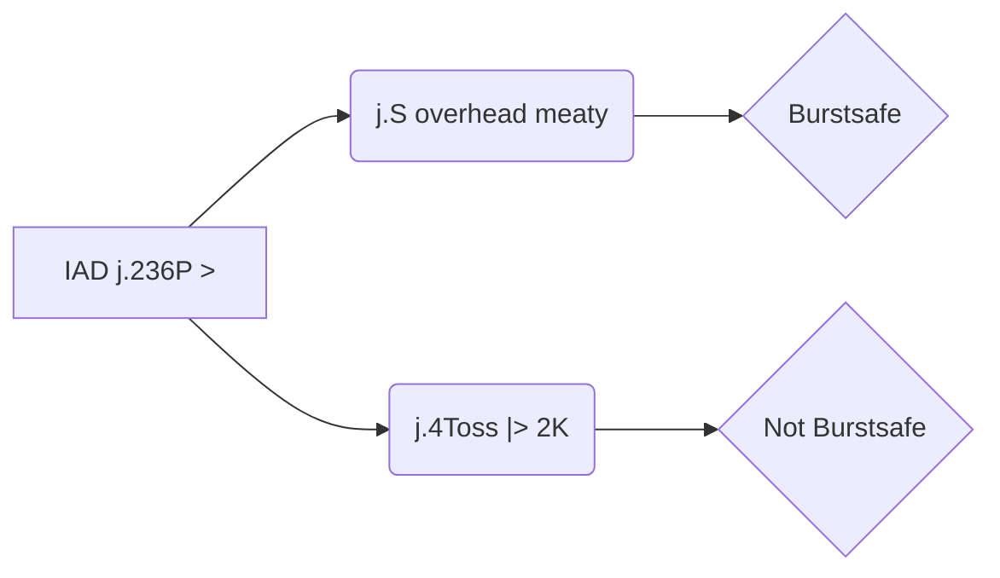

# Relevant links
## Hardli doc

https://docs.google.com/document/d/1VMM1XUubhDn6LfLzp31sOYFsFczlFQPPwhbWBrNxruM/edit

## Dustloop wakeup and backdash framedata

https://www.dustloop.com/w/GGXRD-R2/Frame_Data#Backdash_and_Wake-up_Values

# Corner Bridal IAD j.Pull

## IAD Pull j.S

Gotta check this graph, is pmuch outdated/badderony/useless rn

### j.S vs j.H

> Elphelt j.H KDs on air hit. Elphelt j.S combos on air hit. Like 1f airborne moves like Sol wake up riot stamp or Faust wake up pogo exist, or you miss the meaty and the opponent jumped, or you hit a late frame of a wake up backdash, for example, then j.H doesn't combo. Neither Elphelt j.S nor j.H has proration, but Elphelt j.S deals 28 damage and j.H 34 damage (on Sol), which affects combo damage.  (Text from SmashK, copy paste)

As reference, iad whenever opponent touches the ground, not before.

### Pros / Cons / Mix

- High
- Safejump
- Still not sure how to hit/punish opponents backdashing other than land -> 2pppppp
- Looses to Blitz

### Crouch confirm

##### Crouching confirm 1

2H Toss 2D

https://youtu.be/uXlkOKnFMtU

##### Crouching confirm 2

2H 2D Toss

(easier than [crouching-confirm-1](#crouching-confirm-1))

https://youtu.be/lrbTDjRZ47U

### Standing confirm

I don't think you can get much out of it without meter.

`2D > Toss` berry for oki/meaty afterward.

`j.S > c.S > 5H > Bridal > Toss` or  `j.S > c.S > 2D > Bridal > Toss`  to have explosion active frames on their wakeup...

With meter stuff like Genoverse > Toss would be possible.

#### Metered

`j.S > c.S > f.s > Genoverse > IAD Toss > SG.S > [SG.H]` into UB Setup.

### Standing CH confirm

j.S CH > 66 c.S > dl.5H

We avoid using f.S since it has more pushback than 5H.

With some slimmer characters it might not be possible, I haven't tested.

Vs Thicker characters it might be less annoying.

https://youtu.be/S9RN9cpcZp0

### Airborne Confirm

Certain moves result on the opponent being airborne, meaning that you would need to confirm the j.S CH with an "adequate" routing.

### Punishing DPs/reversals

#### Sol S dp

Sol dp is crouch recovery

##### Route 1

walkup 2D

Do a little walkup

https://youtu.be/J94gVjM5cy4

##### Route 2

f.S > toss > f.S

Do a little walkup

https://youtu.be/7M9Cm5e6Mm8

##### Route 3

f.S 2H(1) Toss

https://youtu.be/vx2LcE36b_g

##### Route 4

Do a little walkup

c.S dl f.S dl 2D > Toss

(cant recommend)

https://youtu.be/uma73yWHGco

#### Sol H DP

#### May [2]8S
If hit meaty at frame 1, she's standing and gets a standing CH, I think that between frames 1 to 3 it's grounded, from +4 it's airborne, I won't confirm that since doesn't seem relevant.

Later she will leave the ground and be airborne, meaning that you would get an air CH.

May Dolphin's are NOT hit invunl (only S is throw invuln).

##### Airborne

Doing 2 SG.S helps to stabilize/control/reduce the opponent height.

https://youtu.be/5MwTgzz-hdk

##### Standing CH

Go to [#standing-ch](#standing-ch)

### Dealing with blitz

#### Bait blitz

Do the safejump a bit early, just bait the blitz, still do j.S to make it more visually appealing. j.S HAS to whiff on wakeup due to the opponent still not being able to be hit. j.S could be replaced by j.H, at-least on tournament your interest is making the button noise to bait the opponent.

> Either do it earlier, so you cannot hit the opponent, or press the button later, so it looks like it will hit the opponent

Wakeup tool input (sol):

Slot 1: `!5SH,5*7,6,2,3S` -> If j.S done too early, you hit blitz/get rejected.

Slot 2: `6,2,!3S` -> If done way too late you get hit

Slot 3: `!6H` -> If done too early, you get thrown

- If you do it earlier you can get thrown on mash.

- If you delay the button you can get thrown on fuzzy mash.

Pick your poison, although I think its better to whiff/delay the button.

I guess if you do the early version you might be able to do land -> backdash.

Delayed/whiff/missed j.S to not hit the blitzshield, although, j.S can just be skipped.

Also, if the opponent presses a button you lose your turn.

Since you are in the air opponent cannot throw you, although if misstimed can get hit by fast moves.

This is only intended to "punish"/bait/callout blitz shield.

##### Showcase of (some) Missed/Whiff/Delayed j.S scenarios

https://youtu.be/ZDzJX1BS9Vo

##### Punish

###### cS 2H routing

https://youtu.be/pxCKEqpqH38

###### Combo 2

This is a bit hard honestly, requires of dash momentum and delays.

Unless you can confirm the opponent stopping the blitz, or, if the opponent character allows for 2D pickup on CH, its recommended to "just throw", the opponent lost 25% meter so is not that bad precisely.

https://youtu.be/hwePx7EBHUI

##### 2D CH Punish

Pickups on 2D CH are character specific and may not work on some of them etc, so anything here is a "concept" if anything.

###### Sol concept 1

https://youtu.be/BuGpfu0XYms

###### Sol concept 2

This is mostly a showtoff etc, on matches it shouldn't be viable since the timing of the bomb can be too tight, meaning that if you are late on the blitz confirm the berry will explode in your face.

https://youtu.be/WRSZ9o0_gyI

### Mixes

#### 6P

It's a bit finniky and rn it's only a concept but w/e works as an example.

https://youtu.be/_F-31diZLZU

## j.D YRC

Solves the issue that [#iad-pull-js](#iad-pull-js) has, it being "how to deal vs blitz".

https://youtu.be/gMh_Sl5k5Ps

Due to the high blockstun it enables for true blockstring into 6P, although afterwards doesn't seem to lead to anything on block...

https://youtu.be/hvG7kq_BJ7c

### Confirms

#### c.S j.SPSH Toss Shotgun

Confirming j.D into 66 c.S helps with proximity/distance consistency.

https://youtu.be/YFLyNpWV3OE

#### 2H Charged Shotgun

Still tight due to 2H into charged shots.

Lightweights might be an issue.

Requires a slight delay after the first charged SG.H, otherwise the opponent will tech out too early.

https://youtu.be/1b4c8sJni8k

#### Charged Shotgun UB

- UB setup

Requires adjustments per weight.

https://youtu.be/IjUJDHiHelg

#### Charged Shotgun Loops

- You get a 6H ender.
- Very consistent (to the exception to the first shotgun which can be quite tight)

https://youtu.be/nGUSufxMMF4

##### Concept of more damage

Don't let the berry hit the opponent before the explosion. Aka delay shotgun shots as much as possible.

The damage is not meaningful anyway so don't bother  with it.

## 5Hx5 Safejump

https://www.youtube.com/watch?v=Aw_d0im2mO4&ab_channel=hardly
