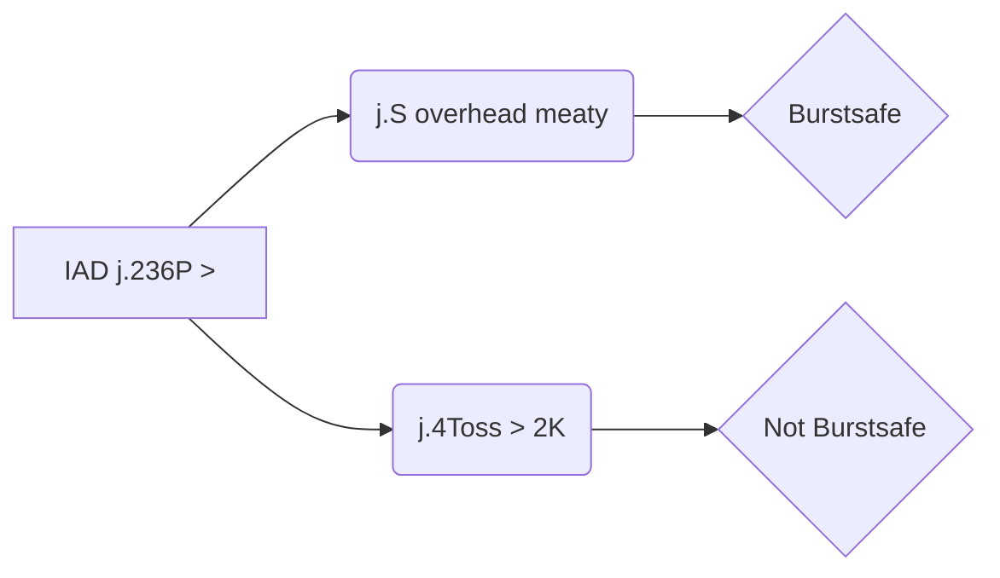

## From Corner Bridal

```mermaid
graph LR
    A[IAD j.236P > ] --> B(j.S overhead meaty)
    A --> C(j.4Toss > 2K)
    B --> D{Burstsafe}
    C--> E{Not Burstsafe}
```

https://www.youtube.com/watch?v=9_S3iGmw9R4