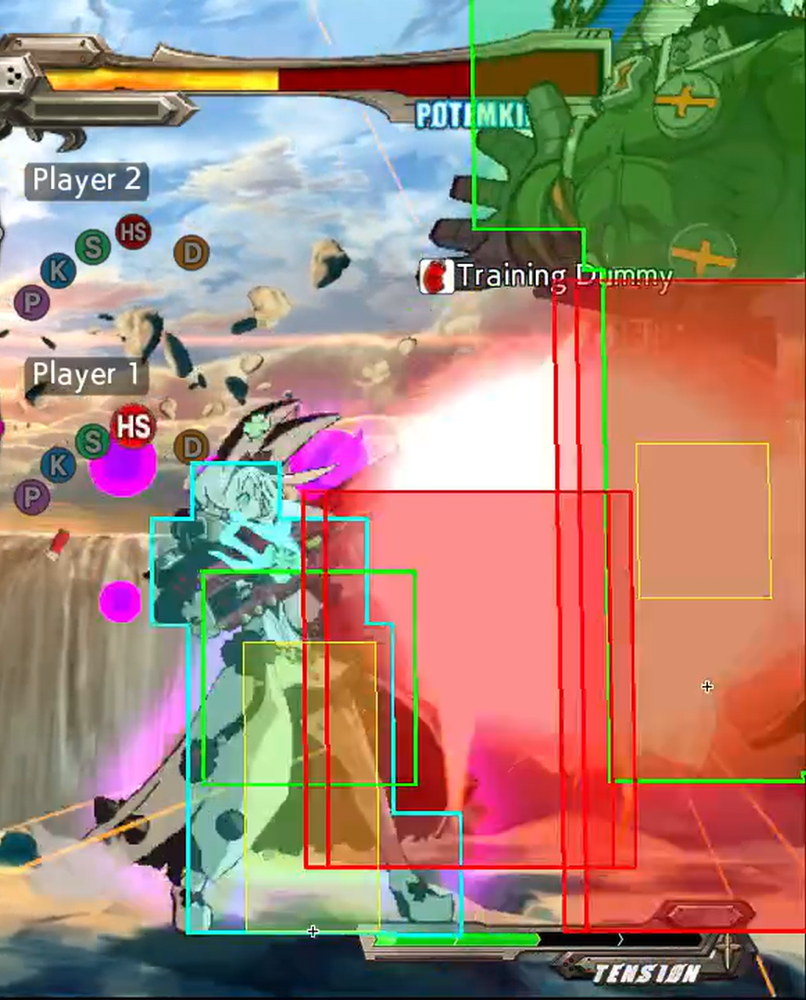

# 

Hey, you, reader, if you are going to jump straight to the exercise, be sure to read the whole part and watching the video example before starting, then, _do the needful_!

Note that the main focus of this is (blah blah blah to fill, shotgun loops, not the advanced things past the microwalks)

Reminder that there is no hurry and that it can be frustrating to practice, but it's something that takes its time and everyone gets used to the timing eventually. Instructions and suggestions described can be very personal, the idea is to feel comfortable through the whole series of exercises, so feel free to make variations on them if they make you feel more comfortable with the exercises.

Some of us are real slow learners and required more time than others, and that's okay!

As long you stick to the game, you will improve.

As well, remember that you are not alone, if you are frustrated at something you can always walk into the [Elphelt Discord Server](https://discord.gg/0g2PWaA3VYwX2c7Z) and ask for feedback, even if it's for something that you already suspect the answer, sometimes it's reassuring verifying that you are on the right track.

# First steps

## Shotgun Stance

## Entering SG Stance

- While not in SG stance (this includes being on sniper stance) do a 236H Motion

https://fireshare.fihome.xyz/w/cc364e40fc0faec70464ce09bd5dbae9

### Leaving SG stance

- On SG Stance do a 236H motion to remove yourself from the SG stance.

- On SG Stance do a 236S motion to enter the sniper stance state

- After shooting, Elphelt will leave the SG stance unless she [reloads](#reloading).

https://fireshare.fihome.xyz/w/c2b4ae42650a5416ad08278f803cc5da

## Reloading

- To reload, after shooting, we do a `4 > 6 > H` input, it can as well be inputted as `4>6H`, the `Hardsslash` button press doesn't require to be at the same time as the 6 input, so inputs like `4>6>5H` would still work (as long it's done within the required timing).
 
- Regarding the input, as long we have the `4` input through the process, we can do `4>3H` or `4>9H`, as well it allows for `4>1>2>3>6H` or the topside equivalent `4>7>8>9>6H`

- This allows to "reload" the shotgun, and we get to keep the shotgun stance.

- The sooner you input the reload, the earlier you will reload, the earlier you will finish reloading.

- Unlike sniper there isn't a "perfect reload" timing. On Shotgun Stance is, the earlier, the better.

Example of reloading late vs early.

https://fireshare.fihome.xyz/w/fed248b984a333e172d9ef954b005341

## Charging shotgun

- Elphelt requires to stand still 14 frames in order to charge shotgun.

- When shotgun is charged, you will momentarily see a pink glow around Elphelt, and as well a specific audio clue.

https://fireshare.fihome.xyz/w/1fec804e37b16e7f2878628fadfef3dd

- If Elphelt moves, crouches or blocks, she will lose the charge and will need to hold for another 14 frames.

https://fireshare.fihome.xyz/w/dac0881f1bc24b0c744f631b8ca56665

- SG.P, SG.K, SG.S, SG.D, Berry Toss and Bridal Express allow Elphelt to keep her charge, meanwhile SG.K resets the timer.

https://fireshare.fihome.xyz/w/4cf5687984b77abcdcecbe142ae26c6d

- The hitbox of the charged shotgun move is bigger and active at frame 1, meanwhile uncharged SG.H is active at frame 3 with a smaller hitbox.

- Charged Shotgun shots deal more damage and if close enough to the opponent (and wall) will walls plat.

- In order to wallsplat, it requires the two inner **hit**boxes (red boxes) to be inside the opponent's **hurt**boxes (green boxes).

## Exercises

### Reloading input

> Note:\
> It's very helpful to have the input display and input history enabled while doing the exercises, as well some exercises might depend on it for some steps.\
> \
> To enable input display, once in the training mode, press start to ender the "Paused Menu", enter the submenu "Display Settings", search for the options "Input History" and "Virtual stick" and enable them.\
> \
> Regarding "Virtual stick's position" set them at will, I personally find it more comfortable set to the center of the screen instead to any of the corners, at latest on these exercises.

This is exercise is aimed towards being used to reloading shotgun input/motion. not to the fastest timing.

First I would recommend trying to _do it_ without previous practice.

Exercise steps:
- Get in shotgun stance
- Shoot
- Try to reload
 
If you are being able to reload consistently, try to keep a rhythm for a while.

If you weren't able to do it at the first try (which is expected!), check the [sub-exercises section](#sub-exercises) for a breakthrough of the whole process. As well, read the [recommendations section](#recommendations).

Example for reference:

https://fireshare.fihome.xyz/w/04a2c998ff8a802130936bf8d935c4b1

#### Recommendations

Wait for the shotgun to charge before shooting, this might help towards keeping a "rythm", the audio clue from Elphelt charging the shotgun and the firing sound can also help towards finding a rythm.

While doing the reload, watch the virtual stick move from left to right, this might help to being more aware of the inputs performed.

On fail: Check the history, this is to "understand" which input we did, in case we didn't notice something while watching the virtual stick.

#### Sub-exercises

I recommend starting slow and paying special attention to the inputs done through the input stick, to ensure we are doing the `4>6H` Input, through the process we can hit corners 

If you are having difficulties being used to the input, you can just visualize it through doing the movement input, without pressing any of the attack buttons.

https://fireshare.fihome.xyz/w/595d1ff31d6b63aedc30180c57b9bbf5

Once you have visualized the movement input, try pressing the `Hardslash` button at the end. Keep special attention to the virtual stick and confirm that you are pressing the `Hardslash` button, at the same time or after than when you are doing the 6 input. In case of doubt, you can also check that through the input history.

https://fireshare.fihome.xyz/w/b5355f9b088fefc3cba8a7f24c0d0cd9

Finally, add a `Hardslash` button at the start, so you do `5H > 4 > 6H`.

If we get 2 `5H` shots, we should be doing the input timing good enough to perform reloads.

https://fireshare.fihome.xyz/w/4d4a2b2c4d1eb1e0e10baadc73f30d25

Once you reached this step, try again the main exercise, and don't hesitate to go back to this sub-exercises if you still have difficulties.

### Reloading timing

On this part I will focus on the "rhythm"/sound of your buttons being pressed, more than the virtual stick input.

https://fireshare.fihome.xyz/w/2b11f283eca202131a07a3ae5970cc53

As well another example with only the game sound.

https://fireshare.fihome.xyz/w/d9b978385abd967463f1682b37ebcc95

If you miss any of the reloads, I suggest on the history checking the most recent input to review why could it have happened. For example you could have done the input `5H (SG.H) > 4 > 5H > 6` or very similarly `5H (SG.H) > 4H > 6`, where on both instances we pressed `Hardslash` too early.  

#### Sub-exercices

Very similarly to the previous sub example, we will be doing the input `5H>4>6H`, and meanwhile in the previous sub-example the focus was to get 2 5H shots, on this sub-exersice the goal is to get the second shot a bit after we have completed the input. 

https://fireshare.fihome.xyz/w/2a7fcd5edb71c32acc609c0c5fa6490e

### Charged shotgun timing

It's very recommended first being a bit consistent on the reloading of shotgun before moving to this step, as it can make the experience very frustrating.

As well, I believe that getting used to reloading will ease some of the exercises mentioned.

#### Exercise 1, sound

The first exercise we don't aim to do nothing further than focusing in the sound Elphelt does when she reloads the shotgun.

> Note:\
> On this exercise, the **AUDIO** cue will be much more helpful than the visual cue, because of that, I encourage to **disable the background music**.\
> \
> The visual cue will be helpful in future steps (specifically on the microwalking section), but I believe that on this one it can create bad habits.

The steps on this exercise will be:

- Pull shotgun
- Wait for Elphelt to charge shotgun and wait a bit longer.
- After waiting for a while, shoot, reload and wait for Elphelt to charge her shotgun.
- Before shooting again, take breath and imagine Elphelt charging the shotgun, specially imagining the "charged sound" she does once it's loaded.
- Once you have done that, shoot, reload and wait again.
- Keep repeating the imaginary process before each shoot, it's very important to be confident before you shoot, if you need more time to "feel it", take it, there is no hurry.

> Note:\
> This doesn't apply to the first one since it's timing can feel a bit different when pulling shotgun than when reloading.

The main goal of this exercise is to be used to the timing between the reload until Elphelt charges the shotgun, so we can have an imaginary rhythm, focusing in the audio cue.

It's okay to mess the reload since it's not the main focus, yet if it's happening very often that it's making you loose focus on this exercise, go back to the [reloading input section](#reloading-input).

As well, if you find yourself doing a movement input before pressing the H, because you are anticipating the reload, try to slow down the inputs, since again there is no hurry, yet if you find yourself having issues with that, go back to the [reloading input section](#reloading-input).

Example for reference:

https://fireshare.fihome.xyz/w/5ff90a3e92fab4cb71d26ae084b75a64

[//]: # (#### Exercise 1.5, sound, a bit faster)

[//]: # ()
[//]: # (It's the exact same exercise as before, just trying to leave a little less time than )

#### Exercise 2, progressive speed up

Using as a base the previous exercise, the idea is to progressively "speed up" (aka, wait past charge for less time) whenever you feel confident/comfortable at your current speed.

If you shoot an uncharged shot, you have to "reset" and go back to a slow(er) timing.

[//]: # (???)
[//]: # (I find it helpful not being very focused on the progression/timing you left waiting, but paying more attention on the "idea of the exercise")

Once you are more or less aware of the charge timing, try to slowly go reducing the extra waited time after charging the shotgun.

Eventually you will reach close to the edge of the timing, where you should try to slowly push it a _bit further_ until you make a mistake and shoot an uncharged shot.

On this exercise, **the main goal is to make mistakes** to develop a timing, therefore one shouldn't be afraid of shooting too early, nor ashamed of having shot too early, as **making mistakes is part of the exercise**.

Example for reference:

https://fireshare.fihome.xyz/w/bda1d3b0169a5c622f2c6d57a55b6f48

## Using Pineberry to charge the shotgun

TODO

## SG.D Pull berry

TODO

# Consolidation exercise

As a consolidation of the previous exercises, I suggest practicing the next combo as it makes you exercise the following points:

- Charge shotgun.
- Reloading shotgun.

Combo example:
https://fireshare.fihome.xyz/w/1d9c9e54d25c074add04559c7d80d5fb

The routing is:

> SG.D > Pull Berry > SG.S > [Charged SG.H]x2 > SG.S > 2Toss > SG.S > Bridal > [Charged SG.H]x6

# Advanced Entry Level

[//]: # (??? Hold 6 after the reload so Elphelt walks forward frame 1.)

## Microwalks

### Practicing extercice

# Advanced

## Links

SG.H > SG.S > Bridal > SG.H

[SG.H] > SG.S > 236P > [SG.H]x3 > ender (usually 6H/5H > Toss > 6H > Pull Berry/SG)

antiair SG.S CH > 236P > [SG.H]x3

antiair SG.S > Bridal > [SG.H]

## Block OS

## Reload OS

https://www.youtube.com/watch?v=cqv5NMfaySI&t=2s

## Setups

# A point on timing for SG.S > SG.H?

# A point on SG.H reload 66 SG.H 

# tmp notes

"microwalking" can also be referenced as micro-walking.

bridal express is  the 214K input

pull berry or berry pull is the 236P input, when we _pull_ the grenade

2Toss/Low toss, is when we do 2P with the grenade on hand, so we throw the grenade "low"

4Toss/High toss, is when we do 4P with the grenade on hand, so we throw the grenade "high"

# Mention taking breaks/stretch/water