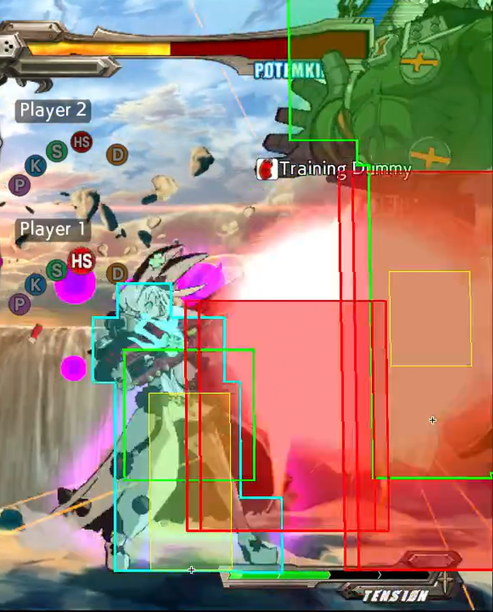

Hey, you, reader, if you are going to jump straight to the exercise, be sure to read the whole part and watching the video example before starting, then, _do the needful_!

Note that the main focus of this is (blah blah blah to fill, shotgun loops, not the advanced things past the microwalks)

**There is no hurry**, and it can be frustrating to practice, but it's something that takes time and everyone can get used to the timing. Instructions and suggestions described can be very personal, the idea is to feel comfortable through the whole series of exercises, so feel free to make variations on them if they make you feel more comfortable with the exercises.

Some of us are real slow learners and required more time than others, and that's okay!

As long you stick to the game, you will improve.

As well, remember that you are not alone, if you are frustrated at something you can always walk into the [Elphelt Discord Server](https://discord.gg/0g2PWaA3VYwX2c7Z) and ask for feedback, even if it's for something that you already suspect the answer, sometimes it's reassuring verifying that you are on the right track.

# First steps

## Shotgun Stance

### Entering SG Stance

- While not in SG stance (this includes being on sniper stance) do a 236H Motion

- We can also do 236K to do a roll that ends with us in shotgun stance. 

https://fireshare.fihome.xyz/w/cc364e40fc0faec70464ce09bd5dbae9

### Leaving SG stance

- On SG Stance do a 236H motion to remove yourself from the SG stance.

- On SG Stance do a 236S motion to enter the sniper stance state

- After shooting, Elphelt will leave the SG stance unless she [reloads](#reloading).

https://fireshare.fihome.xyz/w/c2b4ae42650a5416ad08278f803cc5da

### Reloading

- To reload, after shooting, we do a `4 > 6 > H` input, it can as well be inputted as `4>6H`, the `Hardsslash` button press doesn't require to be at the same time as the 6 input, so inputs like `4>6>5H` would still work (as long it's done within the required timing).
 
- Regarding the input, as long we have the `4` input through the process, we can do `4>3H` or `4>9H`, as well it allows for `4>1>2>3>6H` or the topside equivalent `4>7>8>9>6H`

- The sooner you input the reload, the earlier you will reload, the earlier you will finish reloading.

- Unlike sniper there isn't a "perfect reload" timing. On Shotgun Stance is, the earlier, the better.

Example of reloading late vs early.

https://fireshare.fihome.xyz/w/fed248b984a333e172d9ef954b005341

### Charging shotgun

- Elphelt requires to stand still 14 frames in order to charge shotgun.

- When shotgun is charged, you will momentarily see a pink glow around Elphelt, and as well a specific audio clue.

https://fireshare.fihome.xyz/w/1fec804e37b16e7f2878628fadfef3dd

- If Elphelt moves, crouches or blocks, she will lose the charge and will need to hold for another 14 frames.

https://fireshare.fihome.xyz/w/dac0881f1bc24b0c744f631b8ca56665

- SG.P, SG.K, SG.S, SG.D, Berry Toss and Bridal Express allow Elphelt to keep her charge.

https://fireshare.fihome.xyz/w/4cf5687984b77abcdcecbe142ae26c6d

- The hitbox of the charged shotgun move is bigger and active at frame 1, meanwhile uncharged SG.H is active at frame 3 with a smaller hitbox.

- Charged Shotgun shots deal more damage and if close enough to the opponent will wallsplat if the opponent reaches the wall.

- In order to wallsplat, it requires the two inner **hit**boxes (red boxes) to be inside the opponent's **hurt**boxes (green boxes).

