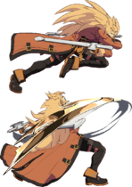

# Kaltes Gestöber Erst

## Kaltes Gestöber Erst

aka. Rekka

- 236S = Erst
- 236H = Zweit
- 214S = Dritt

Combinations available:

| combo               | on block | on IB | imgs                                                               |
|---------------------|----------|-------|--------------------------------------------------------------------|
| 236S                | -1       | -3    |        |
| 236S >  236H        | -3       | -5    |      |
| 236S >  236H > 214S | -7       | -11   |  |

I think that crouch `IBing "Erst" >~ 4SH > 4SH > 1FD` allows to OS throw/Dead Angle Zweit, and block the followup from single rekka

`4SH` as Throw OS

## Kaltes Gestöber Zweit

Leo benefit is nothing meaningful unless RRC or counterhit.

It's plus.

