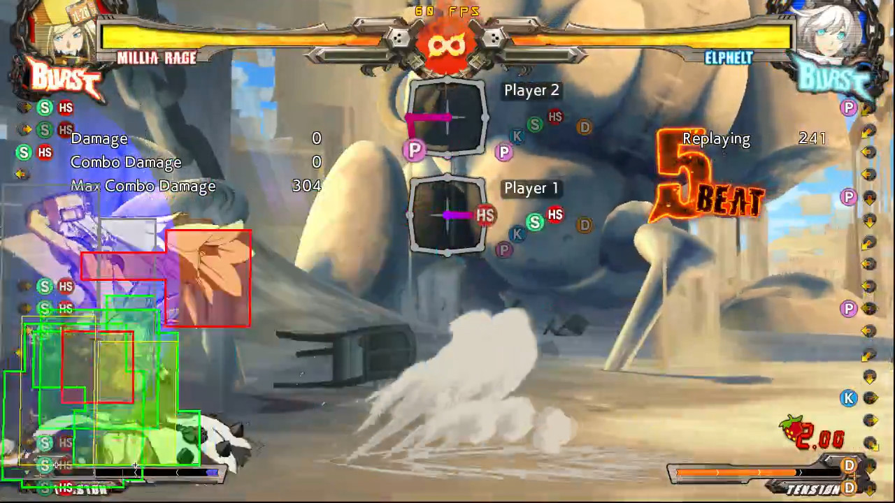

# Dead Angle

Can be low profiled by some moves, such as:

Spaced + delayed 2D

2H

2P (point blank)

## Spaced 2D

Spaced and delayed 2D can go under Millia's dead angle and hit her on the recovery frames, if we have a berry set up we can almost kill Millia, if it's the second time she's been hit, she's definitely going to die.

https://youtu.be/Gdp0unr75Ak

## 2H

2H does go under (requires a bit of preemtiveness)

On the corner we can cancel 2H(1) or 2H(2) > 2D > SG > with a tight runforward SG.P, then toss the berry.

If we cancel 2H(1) we will be less far away than if we did cancel 2H(2) 

### Berry in hand

#### Corner

https://youtu.be/QasMgYm_OWg

### wo Berry but with meter

Either Genoverse or Bridal RC > stuff (the alter is better in the corner)

### wo Berry and wo meter

#### Midscreen

2D Pickup combo

#### Corner

Just do 2D and take the knockdown I guess?

Depending on the berry timing you might be able to do a berry hit-stun toss combo. 

Cannot really do a 2D pickup.

## 2P Concept

If Elphelt is close enough, the dead angle will go over Elphelt.

Although this setup looses to IB > Throw

This setup beats:

- Throw
- Mash
- Dead angle

This very specific setup looses to:

- IB Throw (very tight)
- IB Blitz
- IB reversal

Others:

- Blitz (doesn't get rejected by the berry and gotta play mini-games afterward)

On hitconfirm and with berry setup, you could route into stuff as the following:

- 2P > 2D > Shotgun.H

- 2P > c.S > f.S > 2D/5H > Bridal

- 2P > c.S > f.S > 5H > Shotgun stance

[Example Corner Combo](https://youtu.be/5bJYna9MgSc)

[Concept scenarios](https://youtu.be/gRjloPkhlE4)

In this video, dead angle is pressed at frame 3 from blocking, nevertheless even pressing it at frame 1 it would still work.

!!! example Elphelt Inputs used on the video

    5*8,6*3,5*4,6*17,6K*3,5K*2,5*2,5S*5,5*2,5S*4,5*2,5S*4,5*3,5S*9,2S,2*7,2D*4,2*2,2D*14,1*2,4*4,4K*3,5K*16,5*37,2*3,3*2,6*3,6P,5P*5,5*6,6*2,5*4,6*4,3,2*3,2P*2,5P*2,5*22,6*3,5*3,6*4,3*7,3P*4,3*3,3P*3,3*2,3P*4,3*3,3P*4,3*2,3P*3,3*4,3P*5,3*5

## 2K

The same as 2P, it "can go under if we are very close".

Issue? It requires the stars to align for it to work, so at this point you would do the 2P one.

https://youtu.be/Vaz1kUteMIQ