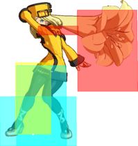

# Dead Angle



## Spaced 2D

Spaced and delayed 2D can go under Millia's dead angle and hit her on the recovery frames, if we have a berry set up we can almost kill Millia, if it's the second time she's been hit, she's definitely going to die.

https://youtu.be/Gdp0unr75Ak

## 2H

> Useful

2H does go under (requires a bit of preemtiveness)

On the corner we can cancel 2H(1) or 2H(2) > 2D > SG > with a tight runforward SG.P, then toss the berry.

If we cancel 2H(1) we will be less far away than if we did cancel 2H(2) 

### Berry in hand

#### Corner

https://youtu.be/QasMgYm_OWg

### wo Berry but with meter

Either Genoverse or Bridal RC > stuff (the alter is better in the corner)

### wo Berry and wo meter

#### Midscreen

2D Pickup combo

#### Corner

Just do 2D and take the knockdown I guess?

Depending on the berry timing you might be able to do a berry hit-stun toss combo. 

Cannot really do a 2D pickup.

## 2P Concept

> Useless except if done the [very specific setup given](https://youtu.be/gRjloPkhlE4), even then it's not that good risk/reward/executionwise


If Elphelt is close enough, the dead angle will go over Elphelt.

Although this setup looses to IB > Throw

!!! success "Wins:"

    - Throw
    - Mash
    - Dead angle
    - Wake up reversal

!!! failure "Looses:"

    - IB Throw (very tight)
    - IB Blitz
    - IB reversal

!!! warning end "Others:"

    - Blitz (not rejected)

On hitconfirm and with berry setup, you could route into stuff as the following:

- 2P > 2D > Shotgun.H

- 2P > c.S > f.S > 2D/5H > Bridal

- 2P > c.S > f.S > 5H > Shotgun stance


[Example Corner Combo](https://youtu.be/5bJYna9MgSc)

[Concept scenarios](https://youtu.be/gRjloPkhlE4)

In this video, dead angle is pressed at frame 3 from blocking, nevertheless even pressing it at frame 1 it would still work.


!!! example "Concept scenarios video wakeup tool inputs"

    ```
    5*8,6*3,5*4,6*17,6K*3,5K*2,5*2,5S*5,5*2,5S*4,5*2,5S*4,5*3,5S*9,2S,2*7,2D*4,2*2,2D*14,1*2,4*4,4K*3,5K*16,5*37,2*3,3*2,6*3,6P,5P*5,5*6,6*2,5*4,6*4,3,2*3,2P*2,5P*2,5*22,6*3,5*3,6*4,3*7,3P*4,3*3,3P*3,3*2,3P*4,3*3,3P*4,3*2,3P*3,3*4,3P*5,3*5
    ```


## 2K

> Useless

The same as 2P, it "can go under if we are very close".

Issue? It requires the stars to align for it to work, so at this point you would do the 2P one.

https://youtu.be/Vaz1kUteMIQ


## 6P

> Useless

You need to be as close of Millia as possible, and also need to _predict_ when Millia is going to press DA

https://youtu.be/yzrZyKdcN2A