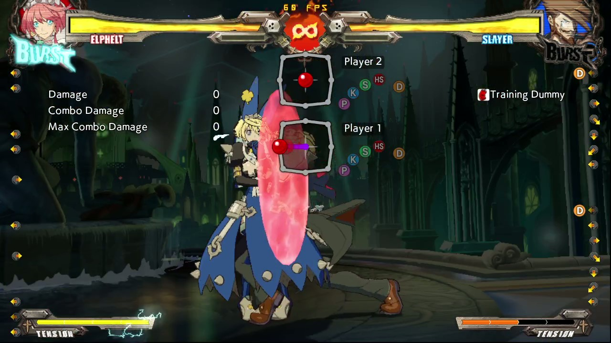

# Dead on Time

## Midscreen

### w.o Shotgun c.S Antiair route

### w.o Shotgun 6H Antiair route

### w Shotgun c.S Antiair route

### w Shotgun 6H Antiair route

### w. Shotgun IB IAD route

- Great amount of screen carry.

- I think that without IB can be done, but it might affect the height.

> CH [SG.H] ...

https://youtu.be/Q0I6nFQLXgE

## Corner

### c.S Antiair route

Generic c.S antiair route.

Other routing can apply.

> CH c.S ~ 2H > 236P, c.S > j.c > j.S > j.c > j.K > j.S > j.H ~ j.toss |> 6H > 236H ~ SG.S > 236H > c.S > j.c > j.K > j.S > j.H > j.D > j.236P

https://youtu.be/RwF4eBPR53s

### w. Shotgun into c.S antiair route

- IBing will give a generous amount of time to remove the shotgun.

We can remove the shotgun and continue with a `c.S` antiair route.

> 236H > CH c.S ~ 2H > 236P, c.S > j.c > j.S > j.c > j.K > j.S > j.H ~ j.toss |> 6H > 236H ~ SG.S > 236H > c.S > j.c > j.K > j.S > j.H > j.D > j.236P

https://youtu.be/eaTfxlhels8

### 6H Antiair route

todo

## Corner Sideswap

### w. Shotgun

Doesn't deal much damage but gives you the corner pressure.

> 236K > SG.S > Bridal

https://youtu.be/HAz296emqUY

### w.o Shotgun IB

- Requires IB

> 236K > SG.S > Bridal

https://youtu.be/5qKF2vRiY58

### w.o Shotgun 6H

- Quite tight ngl.
- Don't think that IBing affect the routing.

> CH 6H > 236K > charge shotgun > [SG.H] > charge shotgun > SG.S > 236P > [SG.H]x3 > SG.S > berry toss > charge shotgun > SG.S > [SG.H] > 6H > 236P

https://youtu.be/765P0ukd-K8

### w.o Shotgun 6H

- Quite tight ngl.
- Don't think that IBing affect the routing.
- I can't make the 3rd SG.H cause wallsplat.

It's based off [6H Counterhit Corner Slightly Spaced route](./Generic_Routes.md#corner-slightly-spaced).

> CH 6H > 236H > charge shotgun > SG.S > [SG.H] > charge shotgun > SG.S > 236P > [SG.H]x3 > SG.S > berry toss > charge shotgun > SG.S > [SG.H]x2 > 6H > 236P

https://youtu.be/vpd3aF7dTuE

## Tips

### How to IB EASILY

Start by already be blocking it, otherwise you will hit by mister frame 0.

Release `4` during the animation, and click `4` again when the animation finishes, basically when the camera is back to slayer.

https://youtu.be/4mpFo3RZZCQ

**Frame on which "press" `4`:**

