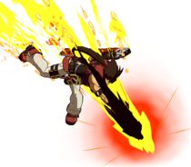

# Bandit Bringer

!!! warning "IB required"

    If IB is not used one cannot punish Sol Bandit Bringer.

On ground **IB** sol is -5 in a **crouching state**, meaning that we can:

- Ground throw (simple)

- 2P (tight)

## Ground throw

- Simple

- Does 55 damage

- With RC it leads to the respective throw combos.

!!! warning "Distance Specific"

    You need to be somewhat close to sol in order to be able to punish with a throw.

https://youtu.be/8Cqm_L0yP10

## 2P

### Bridal ender

> 2P > c.S > f.S > 2H > 2D > Bridal

https://youtu.be/oSHCOS8ZqYw

If we are **very** close, enough for `2S > 2D` to chain, Elphelt can do the `IAD j.Pull j.S Safejump` midscreen.

> 2P > c.S > S > 2D > Bridal

Which allows for an IAD j.Pull j.S Safejump from midscreen

https://youtu.be/apF50AZI8_c

### SG.H ender

Leads to a **midscreen** SG.H safe-jump.

> 2P > c.S > f.S > 2H > 2D > SG.H

https://youtu.be/ja3_KmBXPZ8

!!! warning "If very spaced go for bridal"

    When being substantially spaced SG.H won't knockdown.

    In those scenarios just use Bridal or 2D.

    https://youtu.be/vcMi3DSWpj8

### 2D ender

> 2P > c.S > f.S > 2H > 2D

From this one can go for 2D mixups or the safejump.

https://youtu.be/jomgFOfIvVE