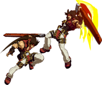

# Ground Viper

 

## wo Shotgun

### c.S Simple Punish

#### BnB Bridal

The simplest of them all:

> c.S > f.S > 2H > 2D > Bridal 

https://youtu.be/w24qFfOwmkc

#### Bridal Ender with IAD j.Pull setup

> 66 dl c.S > f.S > 2D > Bridal

https://youtu.be/3RhHUKq_kRo

!!! Warning "No dash momentum!"

    You **need** to not have dash momentum, otherwise when you do the safejump you will fly over Sol.

!!! Note "Dash momentum alternative"

    The following route allows for dash momentum, at the expense of loosing 40 damage

    > 2PP > c.S > f.S > 2D > Bridal

https://youtu.be/bjk9oE-C59o

### SG.H ender

Leads to a **midscreen** SG.H safe-jump.

> c.S > f.S > 2H > 2D > SG.H

https://youtu.be/WBQFx5BY5sY

### 2D ender

> 2P > c.S > f.S > 2H > 2D

From this one can go for 2D mixups or the safejump.

https://youtu.be/qO-X_Ujt6jA

### Pull Berry

> Pull berry > c.S > f.S > 2H > 2Toss > f.S > *Pickup*

https://youtu.be/0brXJU9b2as (further than right corner)

https://youtu.be/nAYQx8Xbi7Q (closer to right corner)

#### Double berry concept

After tossing `berry > f.S`, cancel into `2H > Pull` followed up on her `2H > Pull` BnB  

https://youtu.be/Z-dybLijREw

## w Shotgun

### Remove shotgun into non-shotgun punish

It's not limited to the `2PP` routing, but it's more consistent than going for the `66 dl c.S` due to reduced time.

As well other routes/punishes are possible.

https://youtu.be/RDwu-A8rP-k

### SG.S antiair

Not limited to this routing, but simple overall.

> SG.S > c.S > j.S > jc > j.KSHD

https://youtu.be/UJfnTNRumH8

### Pull berry SG.S antiair

Probably the most damaging punish with shotgun.

> Pull Berry > SG.S antiair > c.S > j.SPS > j.Toss > 6H > SG.S > c.S > j.SPSHD

https://youtu.be/oyldsAQ1I3I

### SG.PPP... > SG.H

The maximum number of `SG.P` we can fill with is 6.

SG.H leads to a safejump.

> SG.PPPPPP > SG.H

https://youtu.be/3zwqxBXfu6c

### SG.S > Bridal

Simple but you need to time SG.S with Sol touching the ground or being close to do so.

> SG.S > Bridal

https://youtu.be/u4OdvjZjrPg

